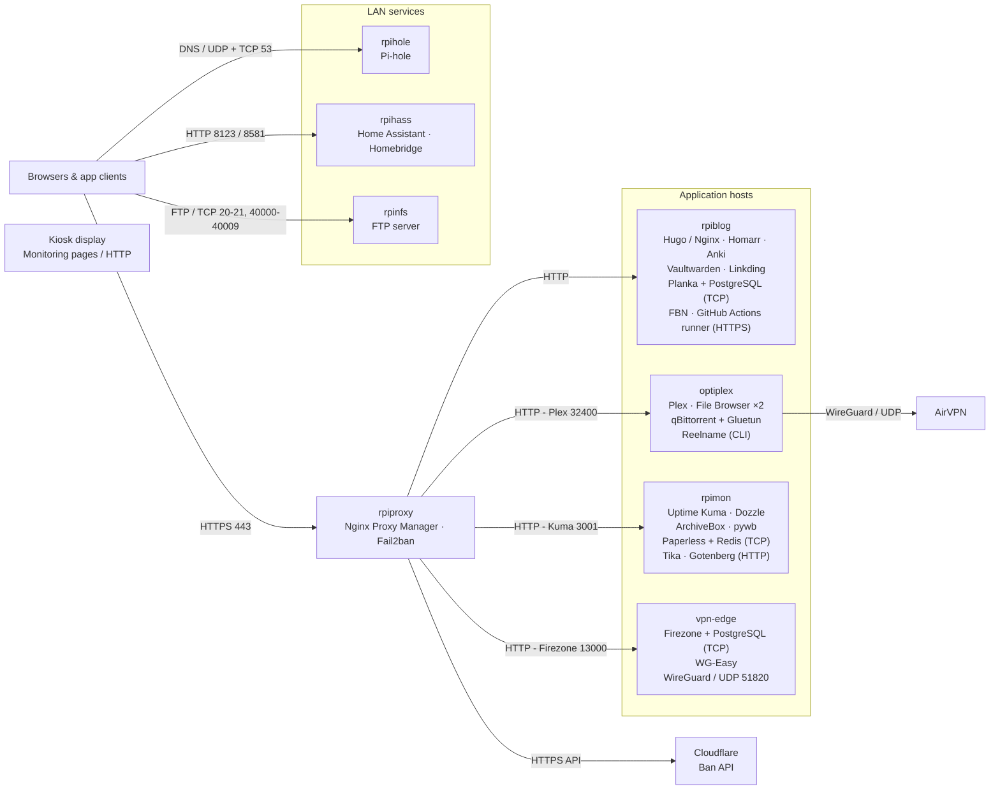

# Homelab

My self-hosted setup for media, bookmarks, passwords, documents, and home automation. Homarr brings the apps together on a homepage called Falling Rock.

Most services have a Docker Compose project under `/opt`. The OptiPlex handles media, `rpiblog` hosts the web apps, and `rpimon` holds monitoring and document tools. Nginx Proxy Manager gives the web apps HTTPS addresses.

## Architecture



Web traffic enters through Nginx Proxy Manager or goes directly to an app's LAN port. qBittorrent uses Gluetun's AirVPN connection; Firezone and WG-Easy are separate remote-access VPN configurations.

[Architecture and storage layout](docs/architecture.md) · [Hosts and reachability](docs/inventory.md)

## Applications

### Homepage and personal apps

These apps share `rpiblog`.

| App | My setup |
| --- | --- |
| [Homarr](docs/apps/homarr.md) | Homepage with app shortcuts, media widgets, and DNS counters |
| [Hugo blog](docs/apps/blog.md) | Static site served by Nginx and published through a [GitHub Actions runner](docs/apps/github-runner.md) |
| [Anki](docs/apps/anki.md) | Private flashcard synchronization endpoint |
| [Vaultwarden](docs/apps/vaultwarden.md) | Password vault for Bitwarden-compatible clients |
| [Planka](docs/apps/planka.md) | Kanban boards backed by [PostgreSQL](docs/apps/postgresql.md) |
| [Linkding](docs/apps/linkding.md) | Searchable bookmark collection |

### Media

The media stack lives on `optiplex` and uses two storage trees, `/mnt/media2` and `/mnt/media3`.

| App | My setup |
| --- | --- |
| [Plex](docs/apps/plex.md) | Streams the media library; [Reelname](docs/apps/reelname.md) is installed alongside it for filename cleanup |
| [qBittorrent](docs/apps/qbittorrent.md) | Downloads to both media trees through [Gluetun](docs/apps/gluetun.md), configured for AirVPN over WireGuard |
| [File Browser](docs/apps/filebrowser.md) | Two web interfaces, one for each media tree |

### Documents and archives

| App | My setup |
| --- | --- |
| [Paperless-ngx](docs/apps/paperless.md) | Document storage and indexing on `rpimon`; [Redis](docs/apps/redis.md) handles task brokering, [Tika](docs/apps/tika.md) extracts text, and [Gotenberg](docs/apps/gotenberg.md) converts documents |
| [ArchiveBox](docs/apps/archivebox.md) | Web-page captures on `rpimon`, with [pywb](docs/apps/pywb.md) for replaying archived pages |
| [FTP server](docs/apps/ftp.md) | Access to a media-download directory on `rpinfs` |

### Monitoring and automation

| App | My setup |
| --- | --- |
| [Uptime Kuma](docs/apps/uptime-kuma.md) | Service monitoring and the status interface on `rpimon` |
| [Dozzle](docs/apps/dozzle.md) | Container logs in the browser, hosted on `rpimon` |
| [FBN](docs/apps/fbn.md) | Facebook-group notifications on `rpiblog` |
| [Home Assistant](docs/apps/home-assistant.md) | Home-automation interface on `rpihass` |
| [Homebridge](docs/apps/homebridge.md) | HomeKit bridge configuration, with the dashboard pointing to `rpihass` |

### Network services

| Service | My setup |
| --- | --- |
| [Nginx Proxy Manager](docs/apps/nginx-proxy-manager.md) | HTTPS routing on `rpiproxy`; [Fail2ban](docs/apps/fail2ban.md) reads its logs and has [Cloudflare](docs/apps/cloudflare.md) and UFW ban actions configured |
| [Pi-hole](docs/apps/pihole.md) | DNS filtering on `rpihole` |
| [Firezone](docs/apps/firezone.md) | Remote-access VPN configuration with PostgreSQL on `vpn-edge` |
| [WG-Easy](docs/apps/wg-easy.md) | Alternative WireGuard server configuration on `vpn-edge` |

### Kiosk display

The [kiosk scripts](docs/apps/kiosk.md) rotate a display through monitoring pages or terminal sessions.

## Configuration files

```text
docker-compose/    Application Compose files
configs/           App settings, proxy-log filters, and service files
scripts/           Kiosk display scripts
docs/apps/         Individual app setups
docs/              Architecture and host details
```
