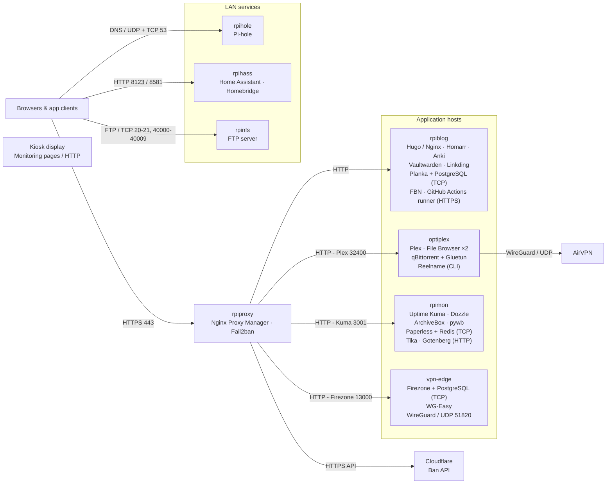

# Homelab

This repository is the public, sanitized control plane for my homelab: Docker Compose templates, supporting configuration, deployment metadata, validation tools, and operating notes. Private `.env` files, credentials, live application databases, and host-specific state stay outside Git.

The lab currently maps 23 Compose projects to eight deployment hosts. Public web traffic enters through Nginx Proxy Manager; storage-heavy media services live on the OptiPlex; web apps and automation share `rpiblog`; monitoring, archives, and document services share `rpimon`.

## System map



Nginx Proxy Manager currently lists nine enabled HTTPS proxy entries: eight subdomains plus the apex/`www` pair. The live route table and its observation date are in [the inventory](docs/inventory.md#https-ingress).

## Host responsibilities

| Host | Responsibility | Projects and components |
| --- | --- | --- |
| `rpiproxy` | Public ingress and request blocking | Nginx Proxy Manager, Fail2ban, Cloudflare ban integration |
| `rpiblog` | Public web apps and automation | Blog, Homarr, Anki, Planka/PostgreSQL, Linkding, Vaultwarden, FBN, GitHub runner |
| `rpimon` | Monitoring, documents, and web archives | Uptime Kuma, Dozzle, Paperless/Redis/Tika/Gotenberg, ArchiveBox/pywb |
| `optiplex` | Media storage and download traffic | Plex, qBittorrent/Gluetun, two File Browser instances, Reelname |
| `rpihole` | LAN DNS | Pi-hole |
| `rpihass` | Home automation | Home Assistant, Homebridge |
| `rpinfs` | File transfer | FTP service backed by a media mount |
| `vpn-edge` | Logical repository name for the Firezone/WG-Easy host | Firezone/PostgreSQL, alternate WG-Easy definition |

The Mac resolves the listed `rpi*` aliases and `optiplex` through `/etc/hosts`. `vpn-edge` is a repository label and was not present in that file when checked; live NPM targets that machine by LAN address. The [inventory](docs/inventory.md#host-name-resolution) records the exact alias relationship without publishing private addresses.

## Start here

| Need | Document |
| --- | --- |
| Understand traffic, dependencies, state, and failure domains | [Architecture](docs/architecture.md) |
| Find a service owner, host, port, route, or data path | [Inventory](docs/inventory.md) |
| Create a sanitized project directory or supply private settings | [Configuration](docs/configuration.md) |
| Update, verify, troubleshoot, back up, or recover a stack | [Operations](docs/operations.md) |
| Read service-specific deployment notes | [Application index](docs/apps/README.md) |
| Configure server-to-client ZIP backups | [Stashfleet](stashfleet/README.md) |

## Repository contract

- [`deployments.json`](deployments.json) maps each Compose project to its intended host or hosts, `/opt` directory, and copied assets.
- [`docker-compose/`](docker-compose) contains sanitized templates and `.env.example` files. These are starting points, not byte-for-byte mirrors of installed projects.
- [`home-assistant-dozzle-agent/`](home-assistant-dozzle-agent) packages the Dozzle agent as a Home Assistant OS app.
- [`configs/`](configs) contains checked-in supporting files. Secrets, personal allowlists, integration tokens, and live databases are excluded.
- [`configs/nginx/routes.json`](configs/nginx/routes.json) records the proxy map with example domains and logical host names. It is documentation, not an Nginx Proxy Manager import.
- Installed state wins during recovery. Never replace a live `.env`, named volume, bind mount, certificate directory, or database with a freshly prepared example.

## Validate the repository

Run the offline checks from the repository root:

```sh
python3 scripts/check.py
python3 -m unittest discover -s tests
```

`scripts/check.py` assembles every project in a temporary directory, renders it with `docker compose config --quiet`, checks file syntax, and verifies local Markdown links. It does not contact a host, build an image, or start a container.

To inspect one prepared project without touching an installation:

```sh
homelab_stage=$(mktemp -d)
python3 scripts/prepare.py planka "$homelab_stage/planka"
cp "$homelab_stage/planka/.env.example" "$homelab_stage/planka/.env"
docker compose --project-directory "$homelab_stage/planka" config
```

Fill required values in the staged `.env` before the final command. `prepare.py` refuses to overwrite an existing destination.

## Backups

[`stashfleet/`](stashfleet) contains the backup CLI used for configurable, read-only server pulls into a local ZIP, with optional rclone upload. A successful file copy is not proof of database consistency: PostgreSQL, SQLite, and application-managed data still need a quiesced copy or an application-level export and a restore test. The [operations guide](docs/operations.md#backup-and-recovery) defines the recovery boundary for these stacks.

## Layout

```text
configs/           Sanitized application and integration configuration
docker-compose/    One reusable Compose template per deployable project
docs/              Architecture, inventory, configuration, and runbooks
deployments.json   Project-to-host(s) and project-to-directory map
home-assistant-dozzle-agent/  Home Assistant OS packaging for the Dozzle agent
repository.yaml    Home Assistant app repository metadata
scripts/           Project preparation, validation, and kiosk helpers
stashfleet/        Standalone backup package, tests, and scheduler examples
tests/             Offline repository checks
```
