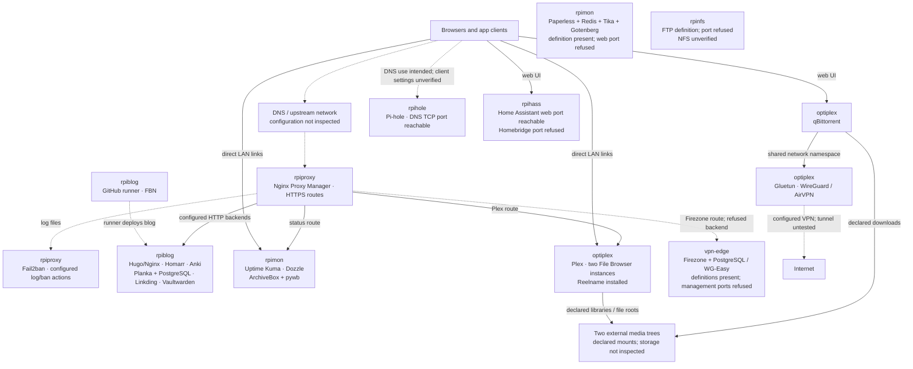

# Homelab



A host-per-role homelab built around independent Docker Compose projects under `/opt`, with a shared HTTPS entry point and a Homarr homepage. The OptiPlex handles media; the other named hosts split web apps, monitoring, DNS, automation, and network services. Hardware models and operating systems were not inventoried.

This snapshot combines the local host aliases, SSH configuration, repository files, read-only `/opt` inspection, the two existing in-app browser tabs, and targeted port checks on **2026-09-09**. Solid lines show inspected routing, declarations, or responding interfaces; they do not imply that every application workflow was tested. Dashed lines identify configured or unverified relationships. Unconnected boxes record definitions whose service path was not established.

Addresses, personal domains, credentials, device identities, and account links are omitted. Host aliases retain the design; `vpn-edge` is a documentation label for the additional host found through the proxy UI. Example domains use `example.com` and are not live links.

## Design and current state

| Read | Contents |
| --- | --- |
| [Architecture](docs/architecture.md) | Request paths, host responsibilities, storage, VPN separation, and failure boundaries |
| [Host inventory and checks](docs/inventory.md) | Every discovered host, SSH outcome, application-port results, and evidence limits |
| [Operations and recovery](docs/operations.md) | Configuration layout, private settings, updates, and backups |

Seven hosts allowed SSH inspection, including the additional VPN host found in NPM. Home Assistant’s web interface responded despite SSH refusal. Paperless, Homebridge, FTP, and both VPN management ports refused connections. These are point-in-time results, not permanent availability claims.

## Web entry and application host

| App | Role / location | Guide |
| --- | --- | --- |
| Nginx Proxy Manager | HTTPS routes on `rpiproxy` | [Setup and route map](docs/apps/nginx-proxy-manager.md) |
| Fail2ban | Proxy-log filtering and ban actions on `rpiproxy` | [Setup](docs/apps/fail2ban.md) |
| Cloudflare | Referenced external DNS/security integration; account configuration unverified | [Integration boundary](docs/apps/cloudflare.md) |
| Homarr | Homepage on `rpiblog` | [Board and integrations](docs/apps/homarr.md) |
| Hugo + Nginx | Static blog on `rpiblog` | [Build and publication](docs/apps/blog.md) |
| GitHub Actions runner | Blog deployment worker on `rpiblog` | [Runner setup](docs/apps/github-runner.md) |
| Anki | Sync endpoint on `rpiblog` | [Setup](docs/apps/anki.md) |
| Vaultwarden | Password-vault service on `rpiblog` | [Setup and recovery](docs/apps/vaultwarden.md) |
| Planka | Boards on `rpiblog` | [Setup and storage](docs/apps/planka.md) |
| Linkding | Bookmarks on `rpiblog` | [Setup](docs/apps/linkding.md) |
| FBN | Custom notification tool on `rpiblog`; runtime unverified | [Bootstrap and state](docs/apps/fbn.md) |

## Monitoring and documents

| App | Role / location | Guide |
| --- | --- | --- |
| Uptime Kuma | Monitoring/status UI on `rpimon` | [Setup](docs/apps/uptime-kuma.md) |
| Dozzle | Container-log UI on `rpimon` | [Setup](docs/apps/dozzle.md) |
| ArchiveBox | Web archive on `rpimon` | [Capture storage](docs/apps/archivebox.md) |
| pywb | WARC replay paired with ArchiveBox | [Replay setup](docs/apps/pywb.md) |
| Paperless-ngx | Document stack on `rpimon`; web port refused | [Setup and recovery](docs/apps/paperless.md) |
| Redis | Internal Paperless task broker | [Dependency setup](docs/apps/redis.md) |
| Apache Tika | Internal Paperless extraction service | [Dependency setup](docs/apps/tika.md) |
| Gotenberg | Internal Paperless conversion service | [Dependency setup](docs/apps/gotenberg.md) |
| Glances | Repository metrics templates; deployment unverified | [Template details](docs/apps/glances.md) |
| Kiosk scripts | Repository display rotation scripts; host unverified | [Display setup](docs/apps/kiosk.md) |

## Media and files

| App | Role / location | Guide |
| --- | --- | --- |
| Plex | Media server on `optiplex` | [Libraries and mounts](docs/apps/plex.md) |
| qBittorrent | Download client on `optiplex` | [Network and download paths](docs/apps/qbittorrent.md) |
| Gluetun | qBittorrent’s outbound VPN namespace | [VPN dependency](docs/apps/gluetun.md) |
| File Browser | Two media-root instances on `optiplex` | [Instance layout](docs/apps/filebrowser.md) |
| Reelname | Media filename utility installed on `optiplex` | [Installation evidence](docs/apps/reelname.md) |
| FTP server | Definition on `rpinfs`; control port refused | [Transfer setup](docs/apps/ftp.md) |
| Stashfleet | Backup client/library in this repository; lab deployment unverified | [Lab considerations](docs/apps/stashfleet.md) · [Full guide](stashfleet/README.md) |

## Network, automation, and supporting services

| App | Role / location | Guide |
| --- | --- | --- |
| Pi-hole | DNS filtering on `rpihole` | [Setup](docs/apps/pihole.md) |
| Home Assistant | Web interface responds on `rpihass` | [Saved configuration](docs/apps/home-assistant.md) |
| Homebridge | Dashboard target on `rpihass`; port refused | [Template details](docs/apps/homebridge.md) |
| Firezone | VPN definition on `vpn-edge`; management port refused | [Setup and port conflict](docs/apps/firezone.md) |
| WG-Easy | Alternative VPN definition on `vpn-edge`; management port refused | [Setup and DNS mismatch](docs/apps/wg-easy.md) |
| PostgreSQL | Separate databases for Planka, Firezone, and the Cal.com template | [Persistence and recovery](docs/apps/postgresql.md) |
| Cal.com | Repository scheduling template; deployment unverified | [Setup](docs/apps/calcom.md) |
| Runtime components | Other `/opt` directories without verified app roles | [Inspection notes](docs/apps/runtime-components.md) |

## Repository layout

```text
README.md          Design introduction and documentation index
docs/              Architecture, evidence, operations, individual app guides
docker-compose/    Saved Compose definitions and update scripts
configs/           Saved application, service, dashboard, and Fail2ban settings
scripts/           Kiosk display scripts
stashfleet/        Independent Python backup library, CLI, tests, and examples
```

Each app guide covers its observed setup, storage, dependencies, recovery, and verification status.
