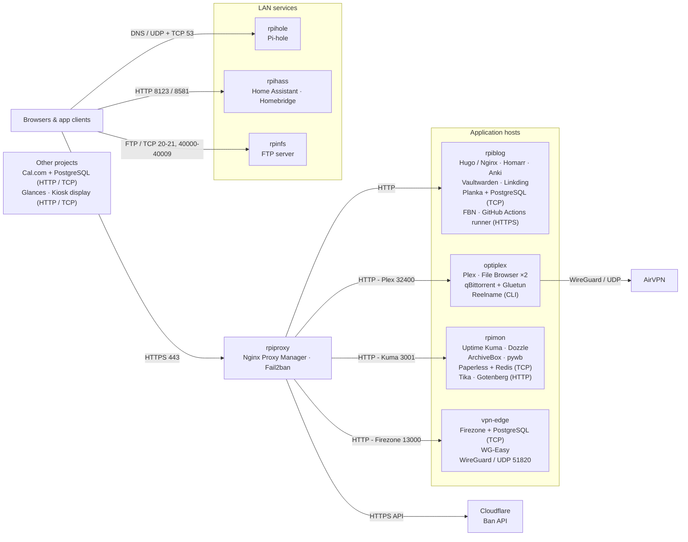

# Homelab

LAN web interfaces use HTTP directly: File Browser on 8080/8081, qBittorrent on 8085, Dozzle on 8080, ArchiveBox on 8002, pywb on 8082, and Paperless on 8000. qBittorrent shares Gluetun's network namespace and exposes torrent traffic on TCP/UDP 6881. Homarr, Dozzle, and the GitHub runner access Docker through a Unix socket.

My homelab splits web apps, media, monitoring, DNS, and home automation across dedicated hosts. Most apps have their own Docker Compose project under `/opt`. Nginx Proxy Manager handles HTTPS routes, and Homarr is the homepage.

The OptiPlex holds the media stack: Plex, qBittorrent behind Gluetun, two File Browser instances, and Reelname. `rpiblog` hosts the web apps, while `rpimon` holds monitoring and document tools.

[Architecture](docs/architecture.md) · [Hosts and reachability](docs/inventory.md)

Host aliases replace private addresses throughout these pages. `vpn-edge` names the host with the Firezone and WG-Easy projects.

## Web apps

| App | Use | Host |
| --- | --- | --- |
| [Homarr](docs/apps/homarr.md) | Homepage and app shortcuts | `rpiblog` |
| [Hugo blog](docs/apps/blog.md) | Static personal site served by Nginx | `rpiblog` |
| [GitHub Actions runner](docs/apps/github-runner.md) | Blog builds and publication | `rpiblog` |
| [Anki](docs/apps/anki.md) | Flashcard synchronization | `rpiblog` |
| [Vaultwarden](docs/apps/vaultwarden.md) | Password vault | `rpiblog` |
| [Planka](docs/apps/planka.md) | Kanban boards | `rpiblog` |
| [Linkding](docs/apps/linkding.md) | Bookmarks | `rpiblog` |
| [FBN](docs/apps/fbn.md) | Facebook-group notifications | `rpiblog` |
| [Cal.com](docs/apps/calcom.md) | Scheduling | Local Compose configuration |

## Media and files

| App | Use | Host |
| --- | --- | --- |
| [Plex](docs/apps/plex.md) | Media library and streaming | `optiplex` |
| [qBittorrent](docs/apps/qbittorrent.md) | Downloads | `optiplex` |
| [Gluetun](docs/apps/gluetun.md) | VPN networking for qBittorrent | `optiplex` |
| [File Browser](docs/apps/filebrowser.md) | Web access to each media tree | `optiplex` |
| [Reelname](docs/apps/reelname.md) | Media filename cleanup | `optiplex` |
| [FTP server](docs/apps/ftp.md) | Access to a download directory | `rpinfs` |
| [ArchiveBox](docs/apps/archivebox.md) | Web-page archive | `rpimon` |
| [pywb](docs/apps/pywb.md) | Replay of archived pages | `rpimon` |
| [Paperless-ngx](docs/apps/paperless.md) | Document archive | `rpimon` |

## Network and home automation

| App | Use | Host |
| --- | --- | --- |
| [Nginx Proxy Manager](docs/apps/nginx-proxy-manager.md) | HTTPS routing | `rpiproxy` |
| [Fail2ban](docs/apps/fail2ban.md) | Log-based ban rules | `rpiproxy` |
| [Cloudflare](docs/apps/cloudflare.md) | External ban-action integration | External service |
| [Pi-hole](docs/apps/pihole.md) | DNS filtering | `rpihole` |
| [Home Assistant](docs/apps/home-assistant.md) | Home automation | `rpihass` |
| [Homebridge](docs/apps/homebridge.md) | HomeKit bridge | Dashboard target: `rpihass` |
| [Firezone](docs/apps/firezone.md) | Remote-access VPN configuration | `vpn-edge` |
| [WG-Easy](docs/apps/wg-easy.md) | WireGuard configuration | `vpn-edge` |

## Monitoring and supporting tools

| App | Use | Host / project |
| --- | --- | --- |
| [Uptime Kuma](docs/apps/uptime-kuma.md) | Availability monitoring | `rpimon` |
| [Dozzle](docs/apps/dozzle.md) | Container logs | `rpimon` |
| [Glances](docs/apps/glances.md) | Host metrics | Local Docker and service configurations |
| [Kiosk display](docs/apps/kiosk.md) | Rotating monitoring display | `scripts/` |
| [PostgreSQL](docs/apps/postgresql.md) | Application databases | Planka, Firezone, Cal.com |
| [Redis](docs/apps/redis.md) | Task broker | Paperless |
| [Apache Tika](docs/apps/tika.md) | Document extraction | Paperless |
| [Gotenberg](docs/apps/gotenberg.md) | Document conversion | Paperless |
