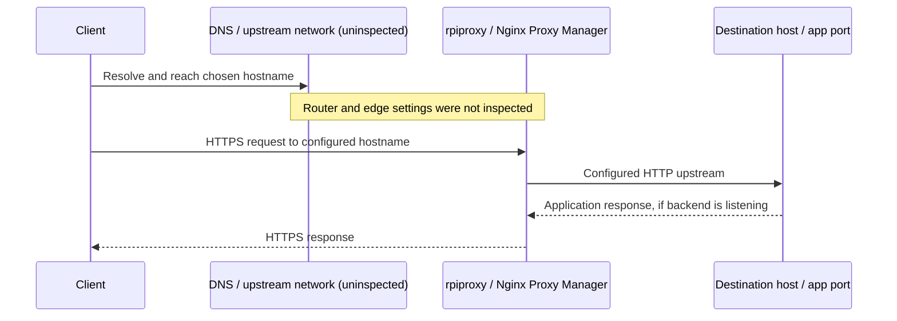
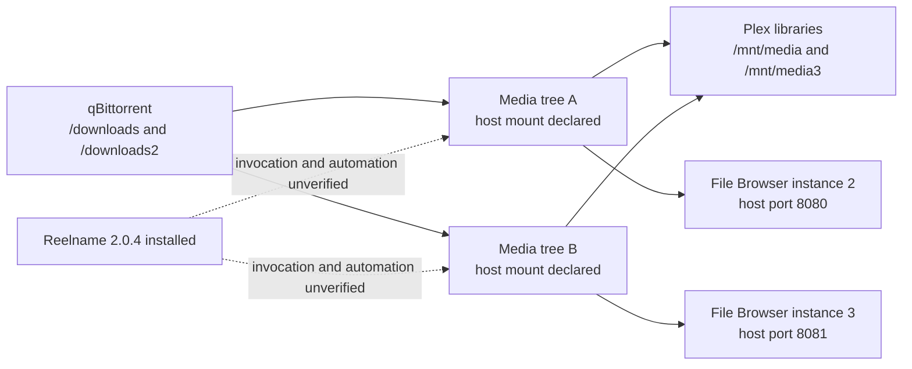

# Architecture

[Homelab index](../README.md) · [Inspection record](inventory.md)

The lab separates services by host responsibility and uses independent Compose projects beneath `/opt`. The application paths describe the intended host role more reliably than a hostname alone: the old password-host alias is inaccessible, while `/opt/vw` and the password proxy route both locate Vaultwarden on `rpiblog`.

## Host responsibilities

| Host | Inspected role | Boundary |
| --- | --- | --- |
| `rpiproxy` | Nginx Proxy Manager and Fail2ban | Shared HTTP/TLS entry point and configured log-based bans |
| `rpiblog` | Blog, dashboard, sync, bookmarks, boards, vault, runner, FBN | Most interactive web apps and their deployment tooling |
| `rpimon` | Kuma, Dozzle, ArchiveBox/pywb, Paperless definition | Monitoring and document/archive processing |
| `optiplex` | Plex, qBittorrent/Gluetun, two File Browser instances, Reelname | Media serving, downloads, and file access |
| `rpihole` | Pi-hole | DNS filtering definition and reachable DNS TCP listener |
| `rpihass` | Home Assistant HTTP response; Homebridge shortcut | Automation host association without filesystem access |
| `rpinfs` | FTP Compose definition | File-transfer intent; neither active FTP nor NFS verified |
| `vpn-edge` | Firezone and WG-Easy definitions | Separate remote-access VPN intent; management ports refused |

The `rpi` aliases suggest a naming convention. They do not establish Raspberry Pi model, CPU architecture, RAM, operating system, or physical topology. No cluster scheduler, shared Docker control plane, failover node, VLAN layout, or NFS export was verified.

## Web request path

NPM’s browser table maps named web endpoints to HTTP backends. The names below substitute `example.com` for the private deployment domain.

The existing NPM tab displayed Let's Encrypt, Public, and Online for all nine rows. This establishes what the UI reports. It does not establish router port forwarding, Cloudflare proxy mode, certificate renewal success, external-network reachability, or each backend’s health. Firezone’s backend port refused a direct connection despite its Online label.

| Logical hostname | Destination | Direct check | Guide |
| --- | --- | --- | --- |
| `anki.example.com` | `rpiblog:8080` over HTTP | Root 404 | [Anki](apps/anki.md) |
| `boards.example.com` | `rpiblog:3001` over HTTP | 200 | [Planka](apps/planka.md) |
| `firezone.example.com` | `vpn-edge:13000` over HTTP | Refused | [Firezone](apps/firezone.md) |
| `home.example.com` | `rpiblog:7575` over HTTP | 307; browser board rendered | [Homarr](apps/homarr.md) |
| `links.example.com` | `rpiblog:9090` over HTTP | 302 | [Linkding](apps/linkding.md) |
| `pass.example.com` | `rpiblog:8089` over HTTP | 200 | [Vaultwarden](apps/vaultwarden.md) |
| `plex.example.com` | `optiplex:32400` over HTTP | 401 | [Plex](apps/plex.md) |
| `status.example.com` | `rpimon:3001` over HTTP | 302 | [Uptime Kuma](apps/uptime-kuma.md) |
| `example.com`, `www.example.com` | `rpiblog:80` over HTTP | 200 | [Blog](apps/blog.md) |

The last row has two names, so nine rows represent ten hostnames. The `hass` shortcut is not among those rows. No missing proxy route was invented to complete the picture.

## Homepage and direct LAN access

Homarr links both to HTTPS proxy names and directly to LAN ports. Its left sidebar exposes Plex, Firezone, NPM, boards, blog, bookmarks, File Browser, and qBittorrent. Its right sidebar exposes ArchiveBox, Pi-hole, status, Homebridge, Dozzle, Home Assistant, Vaultwarden, and Paperless.

Direct LAN links depend on the client reaching the private network. Loading the homepage remotely would not by itself make those destinations accessible. The board’s two document/archive shortcuts still point to an older host that timed out; `/opt` inspection places those definitions on `rpimon`.

Widgets and shortcuts have separate configuration. The torrent widget reported no supported client even though the qBittorrent UI responded. The Pi-hole widget displayed zero counters without establishing a DNS failure. Calendar, weather, personal notes, account identifiers, and device details are deliberately omitted from public documentation.

## Media and storage

The host declarations identify two external media trees. They do not reveal whether the source is local disks, USB storage, network mounts, or something else. `/mnt` was not opened. No automated download-to-rename-to-library pipeline was established, so the diagram does not imply one.

App state uses several storage patterns:

| Pattern | Examples | Recovery consequence |
| --- | --- | --- |
| Relative binds beneath `/opt` | Vaultwarden, Anki, Kuma, Homarr, Plex metadata, ArchiveBox | Preserve complete state directories consistently |
| Docker named volumes | Planka/PostgreSQL, Paperless/Redis, Firezone/PostgreSQL, FBN | An ordinary copy of `/opt` misses the volume data |
| External binds | Plex media, qBittorrent downloads, File Browser roots, FTP data | Include the underlying storage separately |
| Credential-bearing state | Vault data, browser profiles, WireGuard peers, certificates | Encrypt private backups and keep recovery credentials separately |

## Two VPN purposes

[Gluetun’s application VPN](apps/gluetun.md) is configured on the media host: qBittorrent shares its network namespace and Gluetun selects AirVPN/WireGuard. This is an outbound workload dependency. Tunnel establishment and failure behavior were not tested.

[Firezone](apps/firezone.md) and [WG-Easy](apps/wg-easy.md) are remote-access definitions on `vpn-edge`. Both publish UDP 51820 in their saved files, which would conflict if started unchanged on that host. Their management ports refused connections. WG-Easy also references a DNS address different from the current Pi-hole alias. No working remote-access path is asserted.

## Failure boundaries

| Failure | Expected impact from the inspected design |
| --- | --- |
| Proxy host unavailable | Configured HTTPS names lose this ingress path; direct LAN services may still respond |
| `rpiblog` unavailable | Dashboard, vault, bookmarks, boards, sync, and blog share the outage |
| `rpimon` unavailable | Monitoring/log UI and archive services share the outage; alert coverage can disappear with its own host |
| Media mounts missing | Plex, downloads, and File Browser can lose expected data roots even while their UIs respond |
| Gluetun unavailable | qBittorrent’s shared network dependency is affected; exact runtime failure behavior remains untested |

No redundancy, backup completion, or restore success was inferred from folder names. These are consequences of the configured placement, not results of fault-injection testing.
