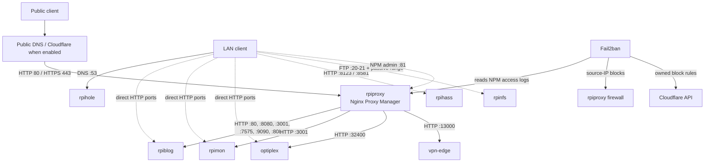
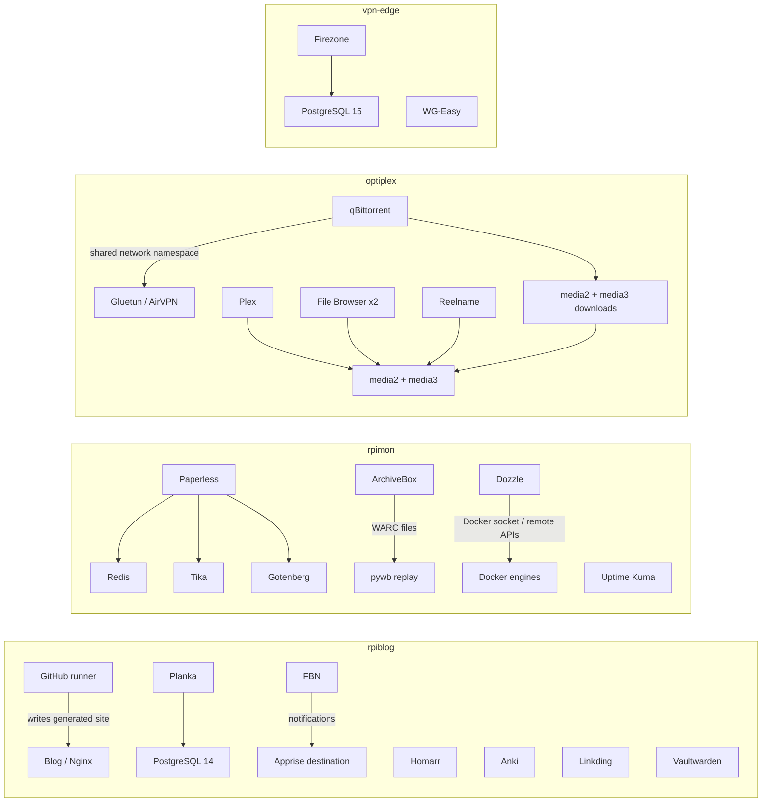

# Architecture

The homelab is split by workload instead of running every service on one machine. `rpiproxy` owns ingress, `rpiblog` owns lightweight public applications, `rpimon` owns monitoring and document workloads, and `optiplex` owns bulk media storage. Dedicated Raspberry Pi hosts provide DNS, home automation, and FTP.

## Traffic paths

The proxy terminates public HTTPS and forwards plain HTTP across the LAN. Some administrative and internal applications are available only through direct LAN ports. The [inventory](inventory.md) separates those access paths and records the current proxy entries.

### Public ingress

Nginx Proxy Manager publishes ports 80 and 443 and keeps its administration interface on port 81. Its persisted `data/` directory contains configuration and access logs; `letsencrypt/` contains certificate state. The nine observed entries use Let's Encrypt certificates and the Public access-list setting.

Nginx accepts `CF-Connecting-IP` only when the connecting peer belongs to the checked-in Cloudflare ranges. Fail2ban reads NPM logs, blocks source addresses at the proxy host, and can create owned Cloudflare block rules. An NPM “Online” row means the proxy entry is enabled in NPM; it does not prove that the target application, its database, or its storage is healthy.

### LAN access

Homarr mixes public HTTPS links with direct LAN links. Dozzle, File Browser, qBittorrent, ArchiveBox, Paperless, Pi-hole, Home Assistant, Homebridge, and the NPM administration page can bypass public ingress when accessed from the LAN. That path is useful for diagnosis because it separates a backend failure from DNS, certificate, Cloudflare, or proxy failures.

## Application dependencies

Compose networks keep both PostgreSQL containers, Redis, Tika, and Gotenberg off host ports. qBittorrent is different: it joins Gluetun's network namespace, so Gluetun publishes the qBittorrent web and torrent ports.

## State and storage

State falls into four recovery classes.

| Class | Examples | Recovery requirement |
| --- | --- | --- |
| Generated or replaceable | Blog `public/`, container images | Rebuild from source or pull the recorded image |
| File-backed application state | Anki `data/`, Homarr `homarr/`, Linkding `data/`, Plex `config/`, Pi-hole directories | Preserve ownership and application compatibility; verify with the application after restore |
| Live databases | Planka and Firezone PostgreSQL volumes; SQLite-backed NPM, Vaultwarden, Uptime Kuma, File Browser, and FBN state | Use an application/database export or quiesce writes before copying; test a restore |
| Bulk user data | Paperless media, ArchiveBox captures, both media trees | Back up independently from container configuration; validate counts, hashes, and application indexing |

Named Docker volumes depend on the Compose project name. Moving a project to a different directory or invoking Compose with a different project name can silently select a new empty volume. Bind-mounted directories depend on the same host paths remaining available.

The OptiPlex media trees couple Plex, qBittorrent, File Browser, and Reelname. A mount failure can therefore appear as several unrelated application failures. Paperless and ArchiveBox keep their primary content on `rpimon`; their helper containers do not own the durable documents or captures.

## Privilege and trust boundaries

| Boundary | Why it matters |
| --- | --- |
| NPM is the shared public ingress | A proxy, certificate, or `rpiproxy` failure affects every public route, even when backends still work on the LAN. |
| Cloudflare client headers are trusted selectively | Accepting forwarded client addresses from arbitrary peers would let a client forge the address evaluated by logs and bans. |
| Homarr, Dozzle, and the GitHub runner mount the Docker socket | Docker-socket access is effectively host-level control. Treat their credentials and web access accordingly. |
| Fail2ban uses host networking plus `NET_ADMIN`/`NET_RAW` | A bad rule can affect host and container traffic. Its Cloudflare cleanup is limited by an ownership journal. |
| Plex, Pi-hole, and Homebridge use host networking | Port collisions and host firewall rules apply directly to these containers. |
| Gluetun, Firezone, and WG-Easy receive network capabilities | Their private keys and state are security-sensitive. Firezone and WG-Easy both default to UDP 51820 on `vpn-edge`, so they cannot bind that port at the same time. |
| Secrets live outside Git | Fresh `.env.example` files are incomplete by design and must never replace an installed environment during an update. |

## Failure domains

| Failure | Expected blast radius | First discriminator |
| --- | --- | --- |
| `rpiproxy` or NPM unavailable | All public HTTPS routes | Test one backend directly on its LAN port |
| `rpiblog` unavailable | Apex site plus Anki, boards, homepage, bookmarks, and password-vault routes | Check SSH/host power, then the affected Compose projects |
| `rpimon` unavailable | Status page, logs UI, archives, and document services | Do not rely on Uptime Kuma alone; test the host and direct ports |
| `optiplex` or a media mount unavailable | Plex, downloads, both File Browser instances, and media rename work | Verify `/mnt/media2` and `/mnt/media3` before restarting applications |
| `rpihole` unavailable | DNS failures for clients that use it | Query another resolver or access a known service by address |
| `vpn-edge` unavailable | Firezone/WireGuard remote access | Check local access before changing proxy or DNS configuration |

## Configuration authority

[`deployments.json`](../deployments.json) is the project-to-host map. Compose files define the reusable service shape. `.env.example` files document inputs, not installed secrets. [`configs/nginx/routes.json`](../configs/nginx/routes.json) is the sanitized route reference. The Mac's `/etc/hosts` file provides local aliases but is not managed by this repository. Dated observations in [inventory.md](inventory.md) describe live state only for the time and surface named there.

[Back to homelab](../README.md)
