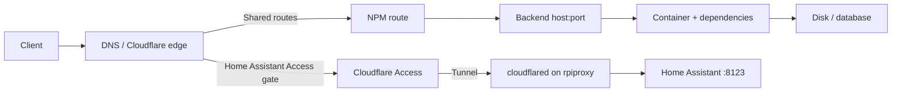

# Operations

Use this runbook for installed projects. Repository validation is offline; host commands are separate operator actions. Replace placeholders with entries from [`deployments.json`](../deployments.json), and inspect the existing project before changing it.

## Safety rules

1. Back up persistent state before changing an image, database, project name, mount, or host path.
2. Preserve the installed `.env`, private files, Compose project name, bind mounts, and named-volume names.
3. Render the effective configuration before pulling or starting anything.
4. Change one project at a time unless its documented dependency requires a coordinated change.
5. Verify the application outcome, logs, and state after the change. A running container or NPM “Online” row is not enough.

Do not use a fresh `.env.example` as an update. It contains placeholders and may omit settings retained by the installed application.

## Find a project

From the repository root:

```sh
project_name=paperless
jq --arg project "$project_name" '.[$project]' deployments.json
```

This returns the intended `host` or replicated `hosts`, directory, Compose filename, and supporting assets. A missing or `null` directory means the repository does not assert a normal installed path.

## Validate before host work

```sh
python3 scripts/check.py
python3 -m unittest discover -s tests
git diff --check
```

For one isolated render:

```sh
homelab_stage=$(mktemp -d)
python3 scripts/prepare.py paperless "$homelab_stage/paperless"
cp "$homelab_stage/paperless/.env.example" "$homelab_stage/paperless/.env"
cp "$homelab_stage/paperless/docker-compose.env.example" "$homelab_stage/paperless/docker-compose.env"
```

Fill required test values in the staged files, then run:

```sh
docker compose --project-directory "$homelab_stage/paperless" config --quiet
```

This proves only that Compose can render the template. It does not validate image compatibility, migrations, host permissions, free space, network access, or application data.

## Inspect an installed project

Run these from the project's installed directory on its host:

```sh
docker compose config --quiet
docker compose ps
docker compose images
docker compose logs --tail=100
docker compose config --volumes
```

Before an update, also record the current image IDs and effective volume names:

```sh
docker compose images --format json
docker volume ls
```

Do not publish `docker compose config` output: it may contain interpolated secrets.

## Update one project

The checked-in update helper previews commands by default. From a checkout available on the target host:

```sh
bash docker-compose/update.sh /opt/kuma
```

The preview prints `config`, `pull`, `build`, and `up -d` without running them. After reviewing the installed configuration, backup, image change, and rollback plan:

```sh
bash docker-compose/update.sh --apply /opt/kuma
```

The helper does not discover projects, remove orphans, prune storage, upgrade the OS, perform database migrations, or verify the application. `update-all.sh` accepts only explicitly listed directories and validates all paths before applying the first project.

### Verify the result

Check all layers that apply:

1. `docker compose ps` shows the expected containers without a restart loop.
2. `docker compose logs --since=10m` has no migration, permission, authentication, or storage errors.
3. The direct LAN endpoint returns the expected application or authentication response.
4. The public HTTPS endpoint works through DNS, Cloudflare when used, the certificate, and NPM.
5. A stateful application can read existing records and complete one harmless, representative operation.

For a monitoring service, confirm that a monitor executes and records a result. For FBN, confirm a scan and delivery outcome. For a database-backed app, confirm expected records rather than stopping at a login page.

### Roll back

Restore the previously recorded Compose file, environment, image reference, and project name, then render the configuration before starting it. Restore persistent state only from a verified backup that matches the application/schema version. Do not start an older database image against a volume already migrated by a newer release unless the application's rollback procedure explicitly supports it.

## Deploy and verify DIUN

DIUN is notification-only and fully distributed. Each conventional host runs one process that combines its local Docker provider with its own file-provider rules, stores registry-manifest history under `/opt/diun-agent/data`, and sends notifications through that host's write-only ntfy token. It checks running containers without stopping them; `watchStopped` only adds containers that are already created or exited. The `rpihass` app is another local instance, but its file provider contains only Homebridge and PairDrop and it requests no Docker API. Every instance runs at each six-hour boundary with up to 45 minutes of jitter. Do not expose a Docker TCP listener, publish a DIUN port, enable automatic changes to monitored images, or print private topic/token values.

1. Confirm DIUN's current release, multi-architecture index digest, Docker and file provider variables, watch variables, and ntfy `tokenFile` behavior against the product documentation. Inspect every declared host for architecture, Docker/Compose version, disk space, socket path, container/image inventory, local-build bases, explicit DIUN labels, installed monitor files, private-input schema, registry reachability, and ntfy reachability.
2. Reconcile Dozzle, `docker ps -a`, and each DIUN Docker-provider inventory. Classify every container image as a public registry reference or a local build. Add an exact local file rule when a fixed tag or local-build base would hide the intended moving channel. Add `watch_repo` only for a specific version-family boundary, with an anchored `include_tags` expression and `notify_on: [new]`. On HAOS, include only the explicitly selected Homebridge and PairDrop channels.
3. Record every application container ID and start time. On each conventional host, stop only `diun`, create a timestamped root-owned mode-0600 archive of `/opt/diun-agent/data`, `.env`, `ntfy-token`, `docker-compose.yml`, and any existing custom or retired rule files, verify the archive listing and SHA-256, then restart DIUN. Create a completed Home Assistant full backup before changing its app. Do not restore any backup without operator approval.
4. Run the repository gates. For every conventional target, assemble a new isolated payload with `python3 scripts/prepare.py diun-agent DESTINATION --host HOST`. Require exactly `docker-compose.yml`, `.env.example`, and the selected `custom-images.yml`. Validate each rule file as JSON/YAML and test it through an isolated DIUN file-provider scan with a temporary database and no notifier. Require zero failed checks; reconcile skipped checks with intentionally filter-excluded seed tags.
5. Roll out one conventional host at a time. Copy only `docker-compose.yml` and that host's `custom-images.yml` to temporary paths, validate the installed Compose model with its existing private inputs without printing it, replace those two files atomically, and run `docker compose up -d --no-deps diun`. Never restart a monitored workload. Compare installed non-secret files with the staged payload by SHA-256 and validate private `.env` key presence without exposing values.
6. Require DIUN 4.33.0, the expected immutable platform digest, a healthy container, both `docker` and `file` providers, a completed startup check, the next six-hour schedule, and no registry, database, TLS, or notification errors. Reconcile provider images with Docker and the host's rule file. Restart only DIUN once more and require a clean unchanged scan, proving the same database survived.
7. After `rpimon`'s combined local process passes, stop and remove only the obsolete `diun-release-watch` container. Remove its live `release-watch.yml` and `release-data` only after they are included in the verified backup. Remove only the obsolete `COMPOSE_PROFILES` and `DIUN_RELEASE_WATCH_WORKERS` lines from its private `.env`; preserve every other line and mode. Do not prune images or restore old files.
8. Publish the reviewed HAOS package version when Supervisor requires the Git-backed custom repository. Update only the DIUN app, preserve its private options and the operator's Protection mode, Watchdog, and Automatic updates choices, enable Start on boot, and start it. Require only the file provider, exactly two entries, a clean scan, and the six-hour schedule. Homebridge, PairDrop, and all other HAOS apps must retain their prior states and start times.
9. Run one native notifier test per host when delivery has not already been proven. Confirm the mobile message identifies the correct host, and separately prove the same publisher token is denied read access. Disable the HAOS `notification_test_on_start` option immediately after its one-time test and restart only DIUN.
10. Recheck every recorded application container ID/start time, all eight DIUN instances, Dozzle host totals and one log stream per non-empty host, and repository-to-host parity. Any unverified host leaves the rollout incomplete.

To roll back a failed host, stop only that DIUN instance and request operator approval before restoring its verified archive. A missing DIUN database produces a new silent baseline; it does not affect workloads. Removing DIUN itself is safer than changing application containers while diagnosing it.

## Reconcile Falling Rock app tiles

The sanitized Homarr board policy is installed as `/opt/homarr/homarr/templates/vis.json`; the LAN-link policy is `/opt/homarr/lan-links.json`; the private logical-host-to-RFC1918 map is `/opt/homarr/lan-addresses.json`; and the private live board remains `/opt/homarr/homarr/configs/vis.json`. Before changing it, stop only Homarr and copy `homarr/configs`, `homarr/icons`, `homarr/data`, the installed project files, and the private address map as one recovery unit. Validate the copied JSON and run SQLite `quick_check` against the copied database.

While Homarr remains stopped, run `/opt/homarr/reconcile-board.py` with `--desired`, `--live`, `--lan-links`, `--lan-addresses`, and `--output` to create a candidate. The reconciler preserves existing status URLs, integrations, widgets, and layout while changing click targets; compare those sections before atomically replacing the live board. Start Homarr, wait for a healthy container, and run the same inputs again with `--check`. Finally, load Falling Rock from a LAN or LAN-routed VPN client and exercise every direct-IP shortcut. A container-side probe verifies reachability but cannot prove browser-only behavior.

## Migrate Uptime Kuma v1 to v2

Uptime Kuma v2 rewrites and aggregates heartbeat history during its first start. Do not interrupt that migration. The official full image tag is `louislam/uptime-kuma:2`; the deprecated `latest` tag stays on v1, and the rootless variants are not recommended for an in-place v1 migration.

1. Confirm the target host is not Debian/Raspbian Buster, the `:2` manifest supports its architecture, the current monitor/notification audits are clean, and enough free space exists for two full copies of `uptime-kuma-data/` plus the new image.
2. Record the v1 application version, immutable image ID/digest, Compose project name, file checksums, database counts, and latest heartbeat. Stop only Uptime Kuma, checkpoint and validate SQLite, then copy the complete project inputs and data directory to a timestamped root-only backup with a SHA-256 manifest.
3. Update the installed private image input to `louislam/uptime-kuma:2`, validate Compose without printing its rendered output, pull the image, and recreate only the Uptime Kuma service. Watch logs until the migration and server startup finish; do not interrupt or restart it while migration is active.
4. Require SQLite `quick_check=ok`, the expected monitor/notification/status-page counts, preserved heartbeat history, a fresh result from every monitor, an idempotent monitor audit, and an idempotent notification audit. Send and read one ntfy test message, then verify the direct LAN endpoint and public HTTPS/status-page route.
5. If migration or verification fails, stop v2 and preserve its failed data directory. Restore the complete quiesced backup and recorded Compose/input files, then start the recorded v1 image. Never point v1 at the migrated v2 database.

If the operator explicitly chooses to discard heartbeat history, first complete and verify the full quiesced backup in step 2. While Kuma remains stopped, create a replacement database from that stopped copy, delete only the `heartbeat` rows, run `VACUUM` and `quick_check`, and verify all non-history object counts before atomically replacing the working database. Retain the untouched backup. On first v2 start, require `No data to migrate` in the migration log and a new successful result from every active monitor. This is an opt-in shortcut, not the default migration path.

## Reconcile Uptime Kuma monitors

The installed `/opt/kuma/reconcile.py` treats `/opt/kuma/monitors.json` as the declared monitor and public status-page state. It resolves sanitized host aliases and `example.com` targets from private `UPTIME_KUMA_*` values in `/opt/kuma/.env`. It requires one active Kuma user and one active default notification; it never exports or prints their credentials.

1. Run `sudo python3 /opt/kuma/reconcile.py` and review `would_add`, `would_update`, `would_prune`, and the status-page result.
2. Confirm the application database and installed files are in the backup scope shown below.
3. Run `sudo python3 /opt/kuma/reconcile.py --apply --prune` to make the live set exactly match the policy. The script creates a root-only, checksummed SQLite backup before writing and refuses if the database changes between its audit and apply phases.
4. Run the audit again. Require `changes_required=false`, then check all monitors have fresh results and the public status page reports the expected groups.
5. If application verification fails, stop Kuma before replacing `uptime-kuma-data/kuma.db` from the printed backup path. Preserve the failed database first, start the same image, and verify monitors, groups, history, and notifications.

Kuma's native JSON import/export is not the repository workflow. The former v1 export included private notification configuration, omitted public status-page groups, and offered an overwrite mode that deleted existing monitor history and notifications. Uptime Kuma v2 removes the deprecated JSON backup/restore feature.

## Reconcile Uptime Kuma notifications with ntfy

The installed `/opt/kuma/reconcile-notification.py` treats `/opt/kuma/notification.json` as the provider policy. Private values come from `UPTIME_KUMA_NTFY_SERVER_URL`, `UPTIME_KUMA_NTFY_TOPIC`, and `UPTIME_KUMA_NTFY_ACCESS_TOKEN` in `/opt/kuma/.env`; the command never prints them.

1. Run `sudo python3 /opt/kuma/reconcile-notification.py --prune` and review the provider, assignment, and extra-notification counts.
2. Run `sudo python3 /opt/kuma/reconcile-notification.py --apply --prune`. The command creates a consistent SQLite backup, sends a test alert before cutover, makes ntfy the only default, reconciles every monitor link, and then removes the old provider.
3. Read the test message with the read-only mobile account, then run the audit again and require `changes_required=false`, `provider_configured=true`, and `all_monitors_linked=true`.
4. Verify that anonymous publish/read and mobile publish fail, while the Kuma token can publish but cannot read.
5. If any application check fails, preserve the failed database, stop Kuma, restore `kuma.db` from the printed `pre-notification-reconcile-*` backup, start the unchanged image, and recheck notifications and monitor history.

The provider test proves the complete Kuma-to-ntfy path. It does not prove delivery during an `rpimon`, NPM, Cloudflare, LAN, or power outage because both applications and the public route share those failure domains.

## Give FBN an isolated ntfy destination

FBN publishes through Apprise. Give it its own random topic and `fbn-publisher` token instead of sharing the monitoring topic or mobile password.

1. Inspect both projects and record the ntfy and FBN image IDs, Compose project names, current private-input modes, persistent state, health, recent scan/delivery results, and the current destination type without printing either URL.
2. Stop only ntfy long enough to archive `data/`, `.env`, `mobile-subscription.txt`, and existing private publisher files. Verify the archive, both copied SQLite databases, and a SHA-256 manifest before restarting the unchanged server. Stop FBN and create a verified archive of its external data volume, private inputs, Compose file, and source revision.
3. Run `add-fbn-publisher.py` against ntfy's private `.env`. Install the updated file plus its restricted output directory, render the real ntfy configuration, and recreate only ntfy without pulling or rebuilding.
4. Replace only `FBN_APPRISE_URL` in FBN's mode-0600 `.env`, render the live Compose model, and recreate only the `fbn` service with the existing image and project identity. Do not rerun bootstrap or replace the external data volume.
5. Require direct and public ntfy health, preserved existing ACLs, anonymous denial, FBN write-only access to only the new topic, and mobile read-only access to both topics. Send one harmless message through FBN's installed Apprise library, read it as the mobile subscriber, confirm it is absent from the monitoring topic, and then check the monitor resumes without restart loops or new delivery errors.

Restore the previous `.env` files and recreate the same images if delivery or an existing ACL regresses. Restore the stopped-state archives only if state/database validation fails; configuration rollback does not require replacing healthy application data.

## Monitor physical drives with Scrutiny

Scrutiny is split between `/opt/scrutiny` on `rpimon` and `/opt/scrutiny-collector` on `optiplex`. The hub is private on port 8083. The collector has raw access only to the declared whole disks and reports one liveness heartbeat to Kuma after each successful collection.

1. On the storage host, run `smartctl --scan-open` with the same container image, capabilities, and device mappings intended for the collector. Require every expected drive to appear and record only sanitized health, temperature, and critical-counter results.
2. Prepare and validate both repository projects. Generate independent InfluxDB, ntfy, and Kuma values in private environments; map USB drives through stable `/dev/disk/by-id` paths rather than mutable `/dev/sdX` names.
3. Start the hub first. Require healthy web and InfluxDB containers and a successful `/api/health` response before starting the collector.
4. Start the collector and inspect its first scan. Require three publish messages, three registered OptiPlex drives, a recent `last-success` marker, healthy container state, and a fresh successful Kuma push heartbeat. Retry wake-up probes are bounded; never accept the collector process exit code alone as proof of a complete scan.
5. Trigger Scrutiny's notification test, read it through the mobile subscriber, and verify the publisher ACL matrix. Re-run both Kuma reconciliation audits and verify the public status page includes the hub and collector monitors.

Scrutiny collection does not start SMART self-tests or scrub a filesystem. Schedule active tests only after checking drive temperature and supported test types. The current NTFS media volumes have no Linux online scrub equivalent; use completed long SMART tests and an appropriate offline filesystem check after thermal remediation. Raspberry Pi microSD media has no standard SMART interface.

## Change container log retention

NPM, Plex, and the standard Dozzle agents default to three 10 MB `json-file` logs per container. Optional `DOCKER_LOG_MAX_SIZE` and `DOCKER_LOG_MAX_FILES` inputs override those limits. Docker discards older rotated logs beyond the configured count; preserve needed history first. Application log files and backups have separate retention.

1. Back up the installed Compose/input files and save the affected container's logs with `docker logs`. For NPM, also make the consistent recovery set described below. Record the running image ID, mounts, project name, and current logging settings.
2. Validate and stage the repository change. Compare the effective configurations without printing private values; only the intended logging settings should change. Preserve host-specific input files and verify the current image tag still resolves to the running image ID.
3. Copy only the changed Compose and example-input files. Recreate only the affected service with `docker compose up -d --no-deps --pull never --no-build SERVICE`, using its existing project directory and project name. Apply the shared Dozzle agent template to every mapped agent host.
4. Verify the running container's `HostConfig.LogConfig`, image ID, mounts, health, and fresh logs. For NPM, verify Nginx syntax, database records, public routes, and Fail2ban log access. For Dozzle, verify the central server can read the remote inventory and a log stream.
5. Compare installed non-secret files with the staged files. If verification fails, preserve failure logs, restore the saved Compose/input files, and recreate the same service with the recorded image. A logging-only change does not require restoring application data.

[Docker's logging documentation](https://docs.docker.com/engine/logging/drivers/json-file/) describes the limits and why restarting an existing container does not apply new logging settings.

## Restore Docker memory metrics on Raspberry Pi

Dozzle uses the Docker statistics API. When `docker stats --no-stream` reports `0B / 0B`, confirm that `docker info` reports `MemoryLimit=false` and that `memory` is absent from `/sys/fs/cgroup/cgroup.controllers`. This identifies a disabled host memory controller rather than a Dozzle agent failure. Docker documents the controller dependency in its [runtime metrics guide](https://docs.docker.com/engine/containers/runmetrics/).

1. Read [`configs/host-os/docker-memory-cgroups.json`](../configs/host-os/docker-memory-cgroups.json), identify the active boot file, and keep its existing root-device and console parameters unchanged.
2. Record the host boot time, kernel version, Docker version, every container's name/state/restart policy, and the boot-file checksum. Confirm that each pre-existing container has a restart policy that will return it after a reboot.
3. Copy the boot file to a timestamped root-owned backup on the same boot filesystem. Append only missing required parameters to its single line, preserve its owner/mode, and verify the resulting token sequence without publishing the full host-specific command line.
4. Reboot one host at a time after explicit operator approval. Wait for SSH and Docker, then compare the container inventory with the pre-change record.
5. Require `memory` in `/sys/fs/cgroup/cgroup.controllers`, `MemoryLimit=true` from `docker info`, nonzero memory totals from `docker stats`, and visible Dozzle memory usage for a container on the repaired host.

For Raspberry Pi's 6.12 downstream kernel, `cgroup_enable=memory` must occur after the device tree's default `cgroup_disable=memory`; the later parameter re-enables the cgroup v2 controller. The Raspberry Pi kernel maintainers document that behavior in [issue 6980](https://github.com/raspberrypi/linux/issues/6980). `/proc/cgroups` is a legacy-interface view and is not the acceptance check for that kernel.

If a host does not return, use local console access to restore the timestamped boot-file backup. If the host returns but the controller remains disabled, restore the backup before attempting a different kernel or firmware change. Do not restart Docker separately during this procedure; the host reboot already restarts it.

## Run Firezone and WG-Easy together

Firezone owns host UDP 51820 on `vpn-edge`. WG-Easy listens on UDP 51820 inside its container but publishes host UDP 51822 through `WG_UDP_HOST_PORT`. The router sends public UDP 51820 and 51822 to matching ports on `rpiproxy`, where NPM forwards the streams to the matching `vpn-edge` ports. Each VPN endpoint uses a separate Cloudflare DNS-only hostname; their separate website hostnames are proxied through Cloudflare and NPM.

1. Record Firezone's container/image IDs and UDP 51820 listener. Stop if Firezone is unhealthy or if another process owns UDP 51822.
2. Stop WG-Easy if it is running, then create a restricted backup of its complete project directory, including the private environment, database, `wg0.conf`, and `wg0.json`. Verify the archive can be listed and its checksum matches the manifest; run SQLite `quick_check` when `wg-easy.db` exists.
3. Set the private WG-Easy image, published ports, insecure-LAN mode, and Docker network values. Keep setup credentials out of the persistent environment. Validate the installed Compose project without printing rendered values.
4. Confirm the VPN endpoint's Cloudflare A or AAAA record is DNS-only and resolves to the router's current public address. Set WG-Easy's database-managed endpoint port to 51822. Forward public UDP 51822 to `rpiproxy` UDP 51822 in the router, and configure NPM's UDP 51822 stream to forward to `vpn-edge:51822`. Configure a separate proxied website hostname to reach WG-Easy TCP 51821 through NPM.
5. Start only WG-Easy without building. Require a healthy container, SQLite `quick_check=ok`, Firezone on `vpn-edge:51820`, WG-Easy on `vpn-edge:51822`, matching NPM streams on `rpiproxy`, both direct and proxied management endpoints, the expected peer count, and a real client handshake through the public endpoint. Update or regenerate any client whose endpoint still uses another hostname or port.

For a pre-v15 migration, import the saved `wg0.json` through the v15 setup workflow, verify the server keys and peer count, then configure the new endpoint and DNS through the application API. If migration or verification fails, stop v15, preserve its failed database, restore the full pre-upgrade project directory and recorded image, and leave Firezone running. Never point the v7 image at `wg-easy.db` as a rollback substitute.

Firezone and WG-Easy store client DNS in their databases as host-only values. Advertise only the private Pi-hole LAN address, keep each VPN's IPv4 and IPv6 default routes enabled, and remove any per-client DNS override that points elsewhere. Back up PostgreSQL before changing Firezone and checkpoint or back up SQLite before changing WG-Easy. Re-download each changed client configuration, then verify public-name resolution through Pi-hole from the refreshed VPN client; a database row or management-page response alone is insufficient.

## Diagnose a public URL

Work from the client inward so each check rules out a layer.



### 1. Check DNS and HTTPS

```sh
route_name=status.example.com
dig +short "$route_name"
curl --head --show-error --connect-timeout 5 "https://$route_name/"
```

An HTTP 3xx or authentication response can still prove the route is reachable. Record the status and `Location` header instead of using `--fail` when the application normally redirects or returns 401/403.

### 2. Check the ingress route

Confirm that the proxy row is enabled, has the intended domain, uses the expected certificate, and targets the host/port in [the route inventory](inventory.md#https-ingress). Then inspect NPM logs around the request time. A 502 or 504 usually moves the investigation to backend reachability; a certificate or DNS error stays at the ingress layer.

For Home Assistant, verify the Cloudflare Tunnel, DNS record, hostname-wide Access application, attached owner policy, exact allowed-email selector, and absence of path exceptions or bypass policies through the Cloudflare API. Check the `cloudflared` container health and logs on `rpiproxy` and the remote hostname rule. Unauthenticated requests to the root, `/api/`, and Companion webhook paths must redirect to Access. After owner authentication in a browser, Home Assistant must still require its own valid session or a separate login. Home Assistant must advertise the public tunnel address as its Internet URL and retain the automatic local URL. Home Assistant 2026.8 and later also require the connector address under **Settings > System > Network > HTTP server > Reverse proxy**. Confirm any changed HTTP-server settings within five minutes after the automatic restart.

### 3. Check the backend directly

From a LAN client or `rpiproxy`:

```sh
backend_host=rpimon
backend_port=3001
curl --head --show-error --connect-timeout 5 "http://$backend_host:$backend_port/"
```

If the backend works directly but the public route fails, inspect its NPM or Cloudflare Tunnel destination, name resolution on `rpiproxy`, Cloudflare state, certificate state, and ingress logs. If the direct backend fails, inspect the target host, Compose project, dependencies, and storage.

### 4. Check application state

```sh
docker compose ps
docker compose logs --since=15m
df -h
df -i
```

For media failures, confirm that `/mnt/media2` and `/mnt/media3` are the intended mounted filesystems before restarting Plex, qBittorrent, or File Browser. An empty mount point can look like data loss while the storage device is merely absent.

### Verify Plex library safeguards

Confirm Plex reports `autoEmptyTrash=0` and `allowMediaDeletion=0`. Both external media mounts must report `RW=false`; do not test the boundary with a file operation. Automatic trash emptying affects Plex library records rather than source media, but leaving it enabled can discard records during a scan when a media filesystem is temporarily unavailable. Manual **Empty Trash** remains possible and should require an explicit operator decision.

Before changing either preference, save and hash a root-only copy of Plex's `Preferences.xml`. Apply a single preference through Plex settings or its authenticated local API, read it back, and confirm the container ID and active sessions are unchanged. Roll back through the same setting interface; do not replace a live `Preferences.xml` while Plex is running.

For analysis scheduling, confirm `GenerateIntroMarkerBehavior=scheduled` and `GenerateCreditsMarkerBehavior=scheduled`. Each setting moves future detection into the configured maintenance window and does not remove existing markers. Change one preference at a time: save and hash `Preferences.xml`, read both marker preferences afterward, and verify the Plex container was not restarted. Restore only the changed preference to its earlier value through the same setting interface if verification fails.

Confirm `ButlerTaskRefreshLibraries=0` while `FSEventLibraryUpdatesEnabled=1`, `FSEventLibraryPartialScanEnabled=1`, `ScheduledLibraryUpdatesEnabled=1`, and `ScheduledLibraryUpdateInterval=86400`. This removes only the maintenance-window library scan; automatic, partial, and daily periodic scans continue. Back up `Preferences.xml`, change only the Butler preference, read all five scan preferences back, and verify that Plex was not restarted. Restore `ButlerTaskRefreshLibraries=1` through the same setting interface if needed.

For remote bandwidth, confirm `WanTotalMaxUploadRate=300000`, `WanPerStreamMaxUploadRate=0`, and `WanPerUserStreamCount=1`. Re-test the server's upload at representative remote-viewing hours before raising the total. Save and hash `Preferences.xml`, change only the total upload preference, read all three bandwidth preferences back, and verify that Plex was not restarted. Restore the earlier unset total with `WanTotalMaxUploadRate=0` if needed. Plex's limit does not control competing qBittorrent traffic.

### Verify media-automation read-only mode

The media-automation stack is safe only while its Docker and application boundaries agree:

1. Confirm `/mnt/media2` and `/mnt/media3` are the intended mounted filesystems before starting the project.
2. Inspect the Radarr, Sonarr, and Bazarr mounts. Every media source must report `RW=false`; only each service's `/config` mount may be writable.
3. Confirm the Compose project has no Docker socket, qBittorrent connection, indexer, subtitle provider, or Seerr-to-Arr service connection.
4. Confirm the four UIs respond on their loopback ports and Plex/qBittorrent retain their earlier container IDs, image IDs, and restart counts.

Do not test the boundary by creating, renaming, or deleting a media file. Docker mount inspection is the parity proof. If any media mount reports writable, stop the three affected services before configuring an application.

Application-level hardening is managed by `/opt/media-automation/manage_safety.py` and the checked-in policy. Run `audit` first. `apply` refuses to proceed unless Radarr and Sonarr each have zero root folders, download clients, and indexers, then writes and verifies an exact pre-change rollback manifest before changing settings. To revert, pass the printed snapshot directory to `restore`; restoration changes only the controlled fields and has the same empty-integration precondition. See the [media-automation setting table and commands](apps/media-automation.md#reversible-application-hardening).

## Common fault patterns

| Symptom | Likely layer | Check first |
| --- | --- | --- |
| Every public hostname fails, direct ports work | DNS, Cloudflare, NPM, or `rpiproxy` | NPM container/logs, ports 80/443, certificate state |
| One public hostname returns 502/504 | Route destination or backend | NPM target, then direct backend port from `rpiproxy` |
| Home Assistant returns Cloudflare 1033 | Tunnel connector | Tunnel status, `cloudflared` health/logs, connector token |
| Home Assistant UI returns an Access login or denial unexpectedly | Cloudflare Access | Owner email selector, Access session, WARP enrollment, then application policy order |
| Companion app cannot connect away from the LAN | Hostname-wide Cloudflare Access gate | Expected without Cloudflare One Client; use the authenticated web interface remotely and the app's internal URL on the LAN |
| Home Assistant returns 400 through the tunnel | Home Assistant reverse-proxy trust | HTTP-server Trust X-Forwarded-For and the connector `/32` |
| NPM says Online but page fails | Backend app, dependency, or state | Direct port, Compose logs, database/storage |
| Paperless loads but jobs stall | Redis, Tika, Gotenberg, or worker path | All four services and webserver logs |
| qBittorrent UI or traffic disappears | Gluetun namespace/VPN | Gluetun health/logs, tunnel state, published ports |
| Plex and both File Browser views lose files | Media mount | Host mount state and filesystem capacity |
| FBN container is stopped | Expected stop-on-account-action or job failure | Last logs, saved state, then browser-session recovery procedure |
| Fail2ban blocks behave unexpectedly | Filter, source-IP trust, action lifecycle | NPM log line, jail status, protected networks, ownership journal |

## Backup and recovery

[`Stashfleet`](../stashfleet/README.md) can pull configured folders read-only, assemble one ZIP, verify a local checksum, and optionally upload through rclone. It backs up regular files and directories; it does not create application-consistent database snapshots, preserve every Linux metadata type, or prove a full application restore.

### Recovery units

| Stack | Persistent recovery unit | Consistency note |
| --- | --- | --- |
| NPM | `/opt/nginx/data`, `/opt/nginx/letsencrypt`, installed Compose/env | Quiesce NPM or copy its SQLite database consistently; keep certificate state with configuration |
| Fail2ban | `/opt/fail2ban/data`, including private policy, database, credentials, and ownership journal | Treat firewall and Cloudflare rules as external state; the journal limits owned-rule cleanup |
| Planka | `data` and `db-data` volumes plus installed env | Prefer PostgreSQL dump plus attachments; version migrations may prevent image-only rollback |
| Firezone | `firezone/`, `postgres-data`, and private env | Preserve keys/salts and use a PostgreSQL-consistent backup |
| Paperless | `data`, `media`, `redisdata`, `consume`, `export`, and private env | Use Paperless export tooling for a portable restore; Redis alone is not the document archive |
| ArchiveBox | `/opt/archivebox/data` | Preserve snapshots, WARC files, and pywb indexes; verify replay after restore |
| Vaultwarden | `/opt/vw/vw-data` plus private SMTP/domain settings | Quiesce writes or use a supported SQLite/database backup path |
| Homarr | `/opt/homarr/homarr/configs`, `homarr/icons`, `homarr/data`, and installed project inputs | Stop Homarr; preserve private board URLs, widgets, integrations, credentials, and SQLite state together |
| Uptime Kuma | `/opt/kuma/uptime-kuma-data` | Quiesce or use a consistent SQLite copy; verify monitors and notification settings |
| ntfy | `/opt/ntfy/data`, private `.env`, `mobile-subscription.txt`, `fbn-private/`, and other restricted publisher files | Stop ntfy for a consistent copy; verify both SQLite databases, ACLs, public subscriptions, and application delivery |
| DIUN | `/opt/diun-agent/data`, private `.env`, and `ntfy-token`; HAOS app configuration on `rpihass` | Stop only the agent for a consistent bbolt copy; loss of the database rebuilds a silent first-check baseline |
| Scrutiny | `/opt/scrutiny/config`, `influxdb`, `influxdb-config`, and private `.env` | Quiesce web and InfluxDB together; collector state is replaceable, but its private device map and Kuma token must be preserved |
| FBN | External `FBN_DATA_VOLUME`, source version, and private auth/config | Protect the browser profile and SQLite state; test that pending delivery state survives |
| GitHub runner | `/opt/gh-runner/runner-config`, installed Compose/env, and labels | Protect the stored runner credentials; if they are unusable, register once with a new one-hour token and then remove it from the container configuration |
| Home Assistant | Encrypted full backup containing configuration, apps, custom integrations, and Supervisor-managed state, plus the emergency kit stored separately | Use the built-in backup inventory to confirm completion; a backup on the same host does not protect against host or storage loss |
| Homebridge | Home Assistant backup entry for the Homebridge app; standalone fallback uses `HOMEBRIDGE_DATA_DIR` | Preserve bridge pairing, UI account, plugin configuration, and credentials; `node_modules` is intentionally excluded and rebuilt from configuration |
| PairDrop | Repository URL and pinned HAOS app/image version | Transfers are peer-to-peer and pairing/preferences are browser-local; reinstalling the app does not restore browser state |
| Media | `/mnt/media2`, `/mnt/media3`, Plex config, qBittorrent config, Gluetun state | Bulk media and app metadata are separate backup units; verify mounts before restore |
| Media automation | `/opt/media-automation/{radarr,sonarr,seerr,bazarr}/config` plus installed Compose/env | Stop the project for a consistent copy of SQLite state; media trees are read-only and are not part of this stack's writable state |
| Pi-hole | `etc-pihole`, `etc-dnsmasq.d`, and private settings | Verify DNS resolution and custom records after restore |
| WG-Easy | `/opt/wg-easy` project/state and private env, plus the verified pre-v15 migration archive | Preserve `wg-easy.db`, generated configuration, keys, and peer state together; stop the app or checkpoint SQLite and restrict backup access |

### Restore test

1. Extract the archive into an isolated case-sensitive destination and verify the recorded checksum and manifest.
2. Restore the database or application export into a disposable instance using the matching application version.
3. Attach copied files with the same paths and permissions expected by the Compose definition.
4. Start the disposable stack without exposing its normal public route or production ports.
5. Verify records, authentication, representative file access, and one application-specific operation.

File extraction and matching hashes prove archive integrity. Only the disposable application test proves that the backed-up state is usable.

[Back to homelab](../README.md)
