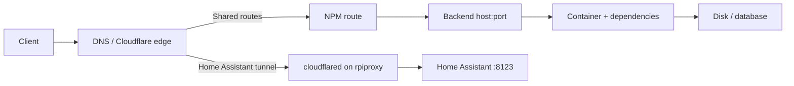

# Operations

Use this runbook for installed projects. Repository validation is offline; host commands are separate operator actions. Replace placeholders with entries from [`deployments.json`](../deployments.json), and inspect the existing project before changing it.

## Safety rules

1. Back up persistent state before changing an image, database, project name, mount, or host path.
2. Preserve the installed `.env`, private files, Compose project name, bind mounts, and named-volume names.
3. Render the effective configuration before pulling or starting anything.
4. Change one project at a time unless its documented dependency requires a coordinated change.
5. Verify the application outcome, logs, and state after the change. A running container or NPM “Online” row is not enough.

Do not use a fresh `.env.example` as an update. It contains placeholders and may omit settings retained by the installed application.

## Find a project

From the repository root:

```sh
project_name=paperless
jq --arg project "$project_name" '.[$project]' deployments.json
```

This returns the intended `host` or replicated `hosts`, directory, Compose filename, and supporting assets. A missing or `null` directory means the repository does not assert a normal installed path.

## Validate before host work

```sh
python3 scripts/check.py
python3 -m unittest discover -s tests
git diff --check
```

For one isolated render:

```sh
homelab_stage=$(mktemp -d)
python3 scripts/prepare.py paperless "$homelab_stage/paperless"
cp "$homelab_stage/paperless/.env.example" "$homelab_stage/paperless/.env"
cp "$homelab_stage/paperless/docker-compose.env.example" "$homelab_stage/paperless/docker-compose.env"
```

Fill required test values in the staged files, then run:

```sh
docker compose --project-directory "$homelab_stage/paperless" config --quiet
```

This proves only that Compose can render the template. It does not validate image compatibility, migrations, host permissions, free space, network access, or application data.

## Inspect an installed project

Run these from the project's installed directory on its host:

```sh
docker compose config --quiet
docker compose ps
docker compose images
docker compose logs --tail=100
docker compose config --volumes
```

Before an update, also record the current image IDs and effective volume names:

```sh
docker compose images --format json
docker volume ls
```

Do not publish `docker compose config` output: it may contain interpolated secrets.

## Update one project

The checked-in update helper previews commands by default. From a checkout available on the target host:

```sh
bash docker-compose/update.sh /opt/kuma
```

The preview prints `config`, `pull`, `build`, and `up -d` without running them. After reviewing the installed configuration, backup, image change, and rollback plan:

```sh
bash docker-compose/update.sh --apply /opt/kuma
```

The helper does not discover projects, remove orphans, prune storage, upgrade the OS, perform database migrations, or verify the application. `update-all.sh` accepts only explicitly listed directories and validates all paths before applying the first project.

### Verify the result

Check all layers that apply:

1. `docker compose ps` shows the expected containers without a restart loop.
2. `docker compose logs --since=10m` has no migration, permission, authentication, or storage errors.
3. The direct LAN endpoint returns the expected application or authentication response.
4. The public HTTPS endpoint works through DNS, Cloudflare when used, the certificate, and NPM.
5. A stateful application can read existing records and complete one harmless, representative operation.

For a monitoring service, confirm that a monitor executes and records a result. For FBN, confirm a scan and delivery outcome. For a database-backed app, confirm expected records rather than stopping at a login page.

### Roll back

Restore the previously recorded Compose file, environment, image reference, and project name, then render the configuration before starting it. Restore persistent state only from a verified backup that matches the application/schema version. Do not start an older database image against a volume already migrated by a newer release unless the application's rollback procedure explicitly supports it.

## Diagnose a public URL

Work from the client inward so each check rules out a layer.



### 1. Check DNS and HTTPS

```sh
route_name=status.example.com
dig +short "$route_name"
curl --head --show-error --connect-timeout 5 "https://$route_name/"
```

An HTTP 3xx or authentication response can still prove the route is reachable. Record the status and `Location` header instead of using `--fail` when the application normally redirects or returns 401/403.

### 2. Check the ingress route

Confirm that the proxy row is enabled, has the intended domain, uses the expected certificate, and targets the host/port in [the route inventory](inventory.md#https-ingress). Then inspect NPM logs around the request time. A 502 or 504 usually moves the investigation to backend reachability; a certificate or DNS error stays at the ingress layer.

For Home Assistant, verify the Cloudflare Tunnel and DNS record through the Cloudflare API, the `cloudflared` container health and logs on `rpiproxy`, and the remote hostname rule. Home Assistant 2026.8 and later also require the connector address under **Settings > System > Network > HTTP server > Reverse proxy**. Confirm any changed HTTP-server settings within five minutes after the automatic restart.

### 3. Check the backend directly

From a LAN client or `rpiproxy`:

```sh
backend_host=rpimon
backend_port=3001
curl --head --show-error --connect-timeout 5 "http://$backend_host:$backend_port/"
```

If the backend works directly but the public route fails, inspect its NPM or Cloudflare Tunnel destination, name resolution on `rpiproxy`, Cloudflare state, certificate state, and ingress logs. If the direct backend fails, inspect the target host, Compose project, dependencies, and storage.

### 4. Check application state

```sh
docker compose ps
docker compose logs --since=15m
df -h
df -i
```

For media failures, confirm that `/mnt/media2` and `/mnt/media3` are the intended mounted filesystems before restarting Plex, qBittorrent, or File Browser. An empty mount point can look like data loss while the storage device is merely absent.

## Common fault patterns

| Symptom | Likely layer | Check first |
| --- | --- | --- |
| Every public hostname fails, direct ports work | DNS, Cloudflare, NPM, or `rpiproxy` | NPM container/logs, ports 80/443, certificate state |
| One public hostname returns 502/504 | Route destination or backend | NPM target, then direct backend port from `rpiproxy` |
| Home Assistant returns Cloudflare 1033 | Tunnel connector | Tunnel status, `cloudflared` health/logs, connector token |
| Home Assistant returns 400 through the tunnel | Home Assistant reverse-proxy trust | HTTP-server Trust X-Forwarded-For and the connector `/32` |
| NPM says Online but page fails | Backend app, dependency, or state | Direct port, Compose logs, database/storage |
| Paperless loads but jobs stall | Redis, Tika, Gotenberg, or worker path | All four services and webserver logs |
| qBittorrent UI or traffic disappears | Gluetun namespace/VPN | Gluetun health/logs, tunnel state, published ports |
| Plex and both File Browser views lose files | Media mount | Host mount state and filesystem capacity |
| FBN container is stopped | Expected stop-on-account-action or job failure | Last logs, saved state, then browser-session recovery procedure |
| Fail2ban blocks behave unexpectedly | Filter, source-IP trust, action lifecycle | NPM log line, jail status, protected networks, ownership journal |

## Backup and recovery

[`Stashfleet`](../stashfleet/README.md) can pull configured folders read-only, assemble one ZIP, verify a local checksum, and optionally upload through rclone. It backs up regular files and directories; it does not create application-consistent database snapshots, preserve every Linux metadata type, or prove a full application restore.

### Recovery units

| Stack | Persistent recovery unit | Consistency note |
| --- | --- | --- |
| NPM | `/opt/nginx/data`, `/opt/nginx/letsencrypt`, installed Compose/env | Quiesce NPM or copy its SQLite database consistently; keep certificate state with configuration |
| Fail2ban | `/opt/fail2ban/data`, including private policy, database, credentials, and ownership journal | Treat firewall and Cloudflare rules as external state; the journal limits owned-rule cleanup |
| Planka | `data` and `db-data` volumes plus installed env | Prefer PostgreSQL dump plus attachments; version migrations may prevent image-only rollback |
| Firezone | `firezone/`, `postgres-data`, and private env | Preserve keys/salts and use a PostgreSQL-consistent backup |
| Paperless | `data`, `media`, `redisdata`, `consume`, `export`, and private env | Use Paperless export tooling for a portable restore; Redis alone is not the document archive |
| ArchiveBox | `/opt/archivebox/data` | Preserve snapshots, WARC files, and pywb indexes; verify replay after restore |
| Vaultwarden | `/opt/vw/vw-data` plus private SMTP/domain settings | Quiesce writes or use a supported SQLite/database backup path |
| Uptime Kuma | `/opt/kuma/uptime-kuma-data` | Quiesce or use a consistent SQLite copy; verify monitors and notification settings |
| FBN | External `FBN_DATA_VOLUME`, source version, and private auth/config | Protect the browser profile and SQLite state; test that pending delivery state survives |
| Home Assistant | Encrypted full backup containing configuration, apps, custom integrations, and Supervisor-managed state, plus the emergency kit stored separately | Use the built-in backup inventory to confirm completion; a backup on the same host does not protect against host or storage loss |
| Media | `/mnt/media2`, `/mnt/media3`, Plex config, qBittorrent config, Gluetun state | Bulk media and app metadata are separate backup units; verify mounts before restore |
| Pi-hole | `etc-pihole`, `etc-dnsmasq.d`, and private settings | Verify DNS resolution and custom records after restore |
| WG-Easy | `/opt/wg-easy` project/state and private env | Contains WireGuard private keys and peer configuration; restrict backup access |

### Restore test

1. Extract the archive into an isolated case-sensitive destination and verify the recorded checksum and manifest.
2. Restore the database or application export into a disposable instance using the matching application version.
3. Attach copied files with the same paths and permissions expected by the Compose definition.
4. Start the disposable stack without exposing its normal public route or production ports.
5. Verify records, authentication, representative file access, and one application-specific operation.

File extraction and matching hashes prove archive integrity. Only the disposable application test proves that the backed-up state is usable.

[Back to homelab](../README.md)
